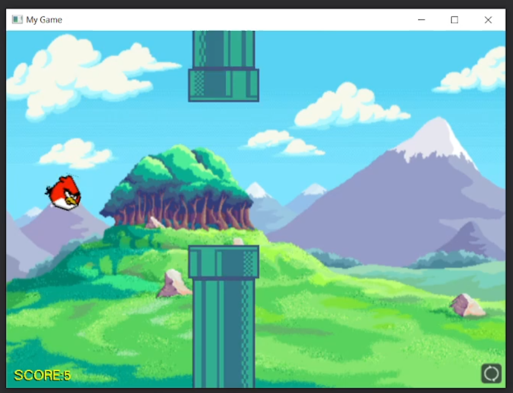

# Flappy Bird GLUT

A simple C++ implementation of Flappy Bird using GLUT OpenGL. Project follows a strict Object Oriented styled. Textures, actors, and menus are all written in isolated class based modules. Project uses the Visual Studio compiler

# How To Play
It's easy, press `SPACE` to fly! Gravity will do the rest.

# Important Note
Framerate and game speed WILL vary on your computer. Physics IS based on framerate, sorry.
